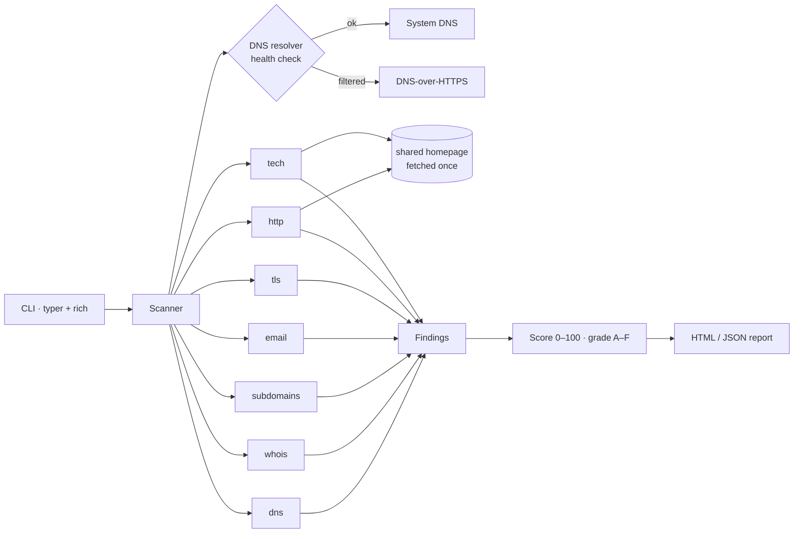

<div align="center">

# 🔍 ReconLens

**Passive OSINT reconnaissance of a domain's external attack surface — with a risk-scored HTML report.**

[](https://github.com/marsilid/reconlens/actions/workflows/ci.yml)


[Русская версия](README.ru.md)

</div>

ReconLens answers the question *"what does the Internet already know about this target, and what is misconfigured?"*
It has four commands — **domain**, **username**, **phone** and **email** — that collect data from public
sources in parallel, turn it into readable findings with concrete fixes, and (for domains) grade the result
from **A** to **F**.

Everything is **passive or equivalent to a normal browser visit**: no port scanning, no brute force, no
exploitation, and no access to private data or breach dumps.

```text
domain    → DNS, WHOIS, subdomains, e-mail security, TLS (+ Russian CA/GOST), HTTP headers,
            technologies, network/ASN + origin-IP-behind-CDN, open ports (Shodan) — A–F score
username  → is this nickname registered on 24 public platforms (GitHub, Habr, Telegram, …)
phone     → country, region, carrier, line type, time zones — fully offline, no network call
email     → the address's domain: deliverability, free/disposable provider, SPF/DMARC, Gravatar
batch     → scan a whole file of domains into one summary table
diff      → show what changed between two scans of the same target
```


## Features

| Module | What it checks |
|---|---|
| `dns` | A, AAAA, MX, NS, TXT, CAA, SOA records · DNSSEC · single-NS setups |
| `whois` | Registrar, creation/expiry dates, transfer lock — RDAP with a raw WHOIS fallback (works for `.ru`/`.рф`) |
| `subdomains` | Subdomains from Certificate Transparency logs (crt.sh → CertSpotter fallback), resolved and flagged if they look like `admin`/`dev`/`jenkins`… |
| `email` | SPF (qualifier, 10-lookup limit, `ptr`), DMARC (policy, `pct`, `rua`, subdomain inheritance), DKIM on common selectors, Null MX · overall **spoofing risk** |
| `tls` | Trust chain, expiry, self-signed, key size, SHA-1 signatures, SAN list, TLS 1.3 support, legacy TLS 1.0/1.1 acceptance, **Russian national CA (НУЦ Минцифры) and GOST cryptography detection** |
| `http` | HSTS, CSP, X-Frame-Options, X-Content-Type-Options, Referrer-Policy, Permissions-Policy · version leaks · cookie flags · HTTP→HTTPS redirect · `security.txt` · `robots.txt` |
| `tech` | Web server, CDN/WAF (Cloudflare, DDoS-Guard, Qrator), CMS (WordPress, Bitrix, Tilda, InSales, MODX, OpenCart, Magento…), frameworks · outdated jQuery (CVE-2020-11022/11023) |
| `netinfo` | Hosting ASN, country and network owner (Team Cymru, no key) · CDN/WAF vs direct-hosting classification · **origin-IP leak search** — finds the real server behind a CDN through adjacent DNS records |
| `shodan` | Open ports and known CVEs from **Shodan InternetDB** — a keyless, passive lookup of data Shodan already collected (no scanning by us) |
| `username` command | Whether a nickname is registered on 24 public platforms (GitHub, GitLab, Habr, Pikabu, Telegram, Codeforces, Keybase, Docker Hub, Steam…), grouped by category |
| `phone` command | Country, region, original carrier, line type and time zones — computed **offline** from Google's libphonenumber data, no network request |
| `email` command | The address's domain: does mail route there (MX), free vs disposable provider, SPF/DMARC presence, public Gravatar. Never sends mail or probes the mailbox |

### 🇷🇺 Russian TLS support (unique)

Since 2022 many Russian banks and government sites serve certificates from the **Russian national CA
(НУЦ Минцифры / Russian Trusted CA)**, whose root is not in the Mozilla/Microsoft/Apple stores. Generic
scanners — SSL Labs, testssl.sh, Hardenize — report these as a plain **"untrusted certificate"**, which
is misleading: the certificate is valid, the foreign trust store simply does not carry its root.

ReconLens recognises this case and reports it as an informational **LOW** with the real explanation
instead of a false **HIGH**. It also detects **GOST cryptography** (GOST R 34.10-2012 keys, GOST R
34.11-2012 signatures) from the certificate's algorithm OIDs — relevant to ФСТЭК/ГОСТ compliance and
something Western tooling does not surface at all.

**Reliability details that matter for a security tool:**

- **No false "record missing" findings on bad networks.** Some resolvers (corporate proxies, sandboxes, a few routers) answer only `A` queries. ReconLens probes the system resolver with records that must exist and automatically switches to **DNS-over-HTTPS** if it is filtered. A DNS timeout is reported as an error, never as "no SPF".
- **Revoked DKIM wildcards** (`*._domainkey TXT "v=DKIM1; p="`) are recognised instead of being counted as keys.
- **Anti-bot interstitials** (200 OK "Just a moment…") are reported as *unknown*, not as "profile found".
- One failing module never breaks the scan; every module has its own time budget.

## Report

Every scan produces a self-contained HTML report (light/dark theme, print-friendly) and optionally JSON.
See [`docs/example-report.html`](docs/example-report.html).


## Installation

**Windows, no terminal needed:** double-click `ReconLens.bat`. On first run it creates a virtual
environment and installs everything, then shows a menu; the report opens in your browser.

Manual setup:

```bash
git clone https://github.com/marsilid/reconlens.git
cd reconlens
python -m venv .venv
# Windows: .venv\Scripts\activate    Linux/macOS: source .venv/bin/activate
pip install -e .
```

Or with Docker:

```bash
docker build -t reconlens .
docker run --rm -v "$PWD/reports:/app/reports" reconlens domain example.com
```

## Usage

```bash
reconlens domain example.com                      # all modules, HTML report in ./reports/
reconlens domain example.com -m email,tls         # only selected modules
reconlens domain example.com --dns doh            # force DNS-over-HTTPS
reconlens domain example.com --fail-under B       # exit code 3 if grade < B (for CI/CD)
reconlens batch domains.txt                        # scan many domains → summary table
reconlens diff old.json new.json                   # what changed between two scans
reconlens username torvalds                       # nickname across 24 platforms
reconlens phone "+7 900 123 45 67"                # offline phone lookup
reconlens email user@example.com                  # e-mail domain lookup
reconlens modules                                 # list all commands and modules
```

Every command writes a self-contained HTML report and accepts `-o report.html`, `--json out.json`
and `--no-open`.

Exit codes: `0` success, `1` target not found / scan error, `2` invalid input.

## How it works



- **Async everywhere** — modules and their network calls run concurrently (`asyncio`, `httpx`, `dnspython`), a full scan takes a few seconds.
- **Pure evaluation functions** — each module separates *collecting* data from *evaluating* it (`evaluate_email`, `analyze_headers`, …), so the security logic is unit-tested without the network.
- **Transparent scoring** — start at 100, subtract 25/15/7/3/0 per critical/high/medium/low/info finding. It is a triage aid, not a formal risk rating.

### Adding a module

```python
# src/reconlens/modules/my_check.py
from reconlens.models import Finding, Severity
from reconlens.modules.base import Module


class MyCheck(Module):
    name = "mycheck"
    title = "My check"
    description = "What it looks at"

    async def run(self, ctx, result):
        page = await ctx.homepage()  # shared HTTP response
        records = await ctx.resolver.resolve(ctx.domain, "TXT")
        result.data = {"txt_count": len(records)}
        if not records:
            result.findings.append(Finding("No TXT records", Severity.INFO))
```

Then add the class to `ALL_MODULES` in `src/reconlens/modules/__init__.py` and write tests for its evaluation logic.

## Development

```bash
pip install -e ".[dev]"
pytest          # 64 offline unit tests
ruff check .    # lint
ruff format .   # format
```

## Legal and ethical use

ReconLens relies on public sources: DNS, Certificate Transparency logs, WHOIS/RDAP, the target's
public web pages and public profile pages, requested the same way a browser does. Phone lookups are
fully offline. It performs **no port scanning, brute forcing or vulnerability exploitation, and does
not touch breach dumps, private data or "people-search" databases** — building a dossier on a private
person is out of scope by design.

A `username`/`phone`/`email` "match" only means a public record exists for that string; it never proves
that one person owns all of them. Use these lookups on your own accounts and footprint, or where you are
lawfully authorised.

Even so, **only assess domains you own or have written permission to test.** Unauthorised security testing
may be illegal in your jurisdiction (e.g. Articles 272–274 of the Criminal Code of the Russian Federation,
the Computer Fraud and Abuse Act in the US). The author is not responsible for misuse.

Good targets for trying the tool: `example.com`, your own domain, and hosts made for testing such as
[badssl.com](https://badssl.com) (`expired.badssl.com`, `self-signed.badssl.com`).

## Roadmap

- [ ] Shodan / Censys integration for open ports (API key, still passive)
- [ ] Have I Been Pwned breach check for domain e-mails (API key)
- [ ] Historical DNS to find origin IPs behind a CDN
- [ ] Web UI (FastAPI) and scan history
- [ ] Diff between two scans of the same domain
- [ ] Public Suffix List instead of the built-in heuristic

## License

[MIT](LICENSE)
