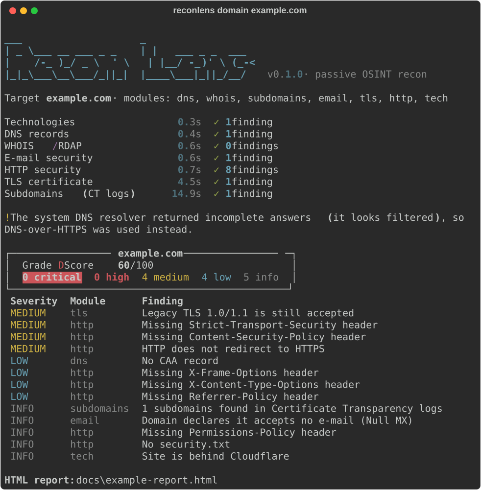
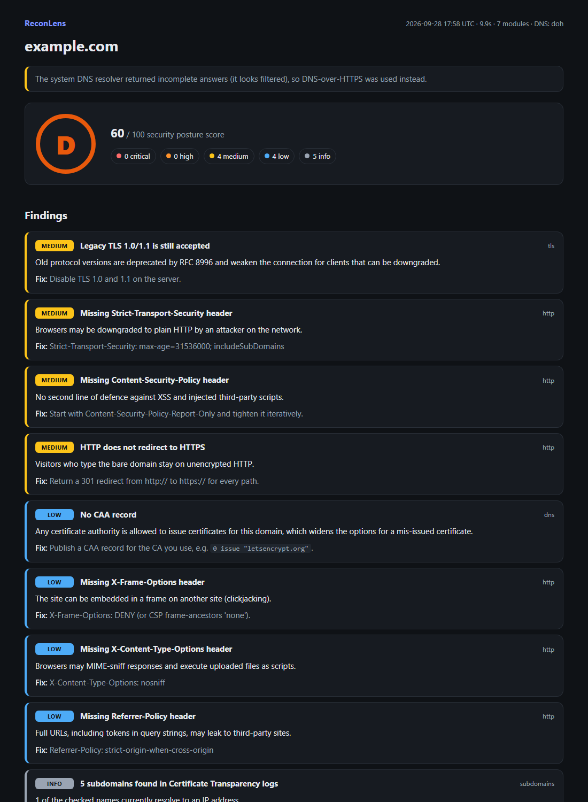

<div align="center">

# 🔍 ReconLens

**Пассивная OSINT-разведка внешней поверхности атаки домена с HTML-отчётом и оценкой риска.**

[English version](README.md)

</div>

ReconLens отвечает на вопрос: *«Что интернет уже знает об этом домене и что в нём настроено неправильно?»*
Инструмент параллельно собирает данные из DNS, WHOIS/RDAP, логов Certificate Transparency, почтовых
записей (SPF/DMARC/DKIM), TLS и HTTP. Затем превращает их в приоритизированные находки с конкретными
рекомендациями и ставит итоговую оценку от **A** до **F**.

Все проверки **пассивные или эквивалентны обычному заходу браузером**: без сканирования портов, перебора и эксплуатации.



## Возможности

| Модуль | Что проверяет |
|---|---|
| `dns` | Записи A, AAAA, MX, NS, TXT, CAA, SOA · DNSSEC · единственный NS |
| `whois` | Регистратор, даты регистрации и окончания, блокировка трансфера. RDAP с откатом на классический WHOIS (работает для `.ru`/`.рф`) |
| `subdomains` | Поддомены из логов Certificate Transparency (crt.sh → CertSpotter), резолв и пометка «подозрительных» (`admin`, `dev`, `jenkins`…) |
| `email` | SPF (квалификатор, лимит 10 DNS-запросов, `ptr`), DMARC (политика, `pct`, `rua`, наследование для поддоменов), DKIM по популярным селекторам, Null MX · итоговый **риск подделки писем** |
| `tls` | Доверие к цепочке, срок действия, самоподписанность, длина ключа, SHA-1, SAN, TLS 1.3, поддержка устаревших TLS 1.0/1.1 |
| `http` | HSTS, CSP, X-Frame-Options и другие заголовки · утечка версий ПО · флаги cookie · редирект HTTP→HTTPS · `security.txt` · `robots.txt` |
| `tls` | Доверие к цепочке, срок действия, ключ, SAN, версия протокола, устаревший TLS · **распознавание сертификатов НУЦ Минцифры и ГОСТ-шифрования** |
| `tech` | Веб-сервер, CDN/WAF (Cloudflare, DDoS-Guard, Qrator), CMS (WordPress, 1С-Битрикс, Tilda, InSales, MODX, OpenCart…), фреймворки · устаревший jQuery (CVE-2020-11022/11023) |
| `netinfo` | ASN, страна и владелец сети хостинга (Team Cymru, без ключа) · CDN это или прямой хостинг · **поиск реального IP за CDN** через соседние DNS-записи |
| `shodan` | Открытые порты и известные CVE из **Shodan InternetDB** — бесплатно и без ключа, читаем то, что Shodan уже собрал (сами не сканируем) |
| команда `username` | Зарегистрирован ли никнейм на 24 публичных площадках (GitHub, GitLab, Хабр, Pikabu, Telegram, Codeforces, Keybase, Docker Hub, Steam…), с разбивкой по категориям |
| команда `phone` | Страна, регион, исходный оператор, тип линии и часовые пояса. Считается **офлайн** из данных Google libphonenumber, без единого запроса в сеть |
| команда `email` | Домен адреса: доходит ли туда почта (MX), бесплатный или одноразовый провайдер, наличие SPF/DMARC, публичный Gravatar. Письма не отправляются, ящик не проверяется |

### 🇷🇺 Поддержка российского TLS (чего нет у западных инструментов)

Многие банки и госсайты используют сертификаты **НУЦ Минцифры** (Russian Trusted CA), корневой которого
не входит в хранилища Mozilla/Microsoft/Apple. Западные сканеры (SSL Labs, testssl.sh, Hardenize) пишут
про такой сертификат просто **«не доверенный»** — и это вводит в заблуждение: сертификат валиден, просто
чужое хранилище не содержит его корень.

ReconLens распознаёт этот случай и выдаёт информационный **LOW** с настоящим объяснением вместо ложного
**HIGH**. А ещё определяет **ГОСТ-шифрование** (ключи ГОСТ Р 34.10-2012, подписи ГОСТ Р 34.11-2012) по
OID-алгоритмов в сертификате — это про требования ФСТЭК/ГОСТ, и такого не показывает ни один западный
инструмент.

**Надёжность, важная для ИБ-инструмента:**

- **Нет ложных «записи нет» в плохих сетях.** Некоторые резолверы (корпоративные прокси, песочницы,
  часть роутеров) отвечают только на A-запросы. ReconLens проверяет системный DNS на заведомо
  существующих записях и при фильтрации автоматически переключается на **DNS-over-HTTPS**. Таймаут DNS
  считается ошибкой, а не находкой «нет SPF».
- **Отозванные wildcard-записи DKIM** (`v=DKIM1; p=`) распознаются, а не считаются ключами.
- **Антибот-заглушки** («Just a moment…» с кодом 200) дают статус «неизвестно», а не «профиль найден».
- Падение одного модуля не ломает сканирование, у каждого модуля свой лимит времени.

## Отчёт



## Установка и запуск

**Самый простой способ (Windows):** дважды кликни `ReconLens.bat`. При первом запуске он сам всё
установит, дальше появится меню: выбираешь пункт, вводишь домен, отчёт открывается в браузере.

Через терминал:

```bash
git clone https://github.com/marsilid/reconlens.git
cd reconlens
python -m venv .venv
# Windows: .venv\Scripts\activate    Linux/macOS: source .venv/bin/activate
pip install -e .

reconlens domain example.com                 # все модули, HTML-отчёт в ./reports/
reconlens domain example.com -m email,tls    # только выбранные модули
reconlens username torvalds                  # никнейм на 24 площадках
reconlens phone "+7 900 123 45 67"           # телефон офлайн
reconlens email user@example.com             # домен e-mail адреса
reconlens modules                            # список команд и модулей
```

⚠️ **Важно:** инструмент не лезет в базы утечек и не собирает досье на человека — это осознанное
ограничение. Совпадение по нику, телефону или почте означает лишь, что есть публичная запись с такой
строкой, а не что всё это принадлежит одному человеку. Проверяй свои аккаунты и свой след, либо там,
где есть разрешение.

## Архитектура

- **Асинхронность**: модули и их сетевые запросы выполняются параллельно (`asyncio`, `httpx`, `dnspython`),
  полное сканирование занимает несколько секунд.
- **Сбор данных отделён от оценки**: логика ИБ (`evaluate_email`, `analyze_headers`…) покрыта
  unit-тестами без обращения к сети.
- **Прозрачная оценка**: старт со 100 баллов, минус 25/15/7/3/0 за critical/high/medium/low/info.
  Это инструмент приоритизации, а не формальная оценка риска.
- **Плагинная архитектура**: новый модуль — это класс-наследник `Module` плюс одна строка в реестре
  (пример в [README.md](README.md#adding-a-module)).

## Правовые и этические аспекты

ReconLens использует только открытые источники: DNS, логи Certificate Transparency, WHOIS/RDAP и
публичные страницы сайта, запрашиваемые так же, как их запрашивает браузер. Инструмент **не сканирует
порты, не перебирает пароли и не эксплуатирует уязвимости**.

Тем не менее **проверяйте только свои домены или домены, на проверку которых есть письменное
разрешение владельца.** Несанкционированное тестирование может нарушать закон (ст. 272–274 УК РФ).

Для знакомства с инструментом подходят `example.com`, ваш собственный домен и специальные тестовые
стенды, например [badssl.com](https://badssl.com).

## Планы

- [ ] Интеграция с Shodan / Censys (открытые порты по API, всё ещё пассивно)
- [ ] Проверка утечек через Have I Been Pwned
- [ ] Исторический DNS для поиска реального IP за CDN
- [ ] Веб-интерфейс (FastAPI) и история сканирований
- [ ] Сравнение двух сканирований одного домена

## Лицензия

[MIT](LICENSE)
